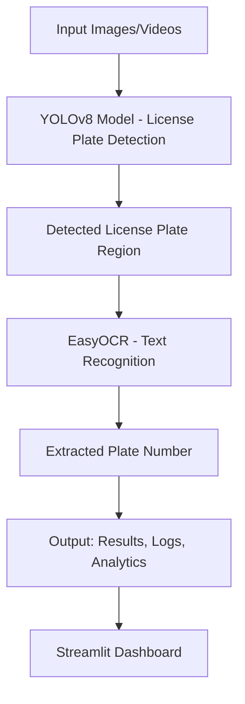

# Automatic Number Plate Recognition (ANPR) using YOLOv8 & EasyOCR

This project implements an **Automatic Number Plate Recognition (ANPR)** system using **YOLOv8** for license plate detection and **EasyOCR** for text recognition. It includes training, evaluation, video processing, and a user-friendly **Streamlit dashboard**.

---

## Problem Statement
Automatic Number Plate Recognition (ANPR) is a critical technology for **traffic monitoring, toll collection, smart parking, law enforcement, and logistics tracking**. Traditional systems often struggle with challenges like:
- Low-light or poor weather conditions
- Motion blur from moving vehicles
- Non-standard or occluded license plates
- Varying plate sizes and fonts

This project addresses these challenges using **YOLOv8 for robust plate detection** and **EasyOCR for efficient text extraction**, providing a modular and deployable solution.

---

## Features
- **License Plate Detection** using YOLOv8
- **Text Extraction (OCR)** with EasyOCR
- **Video Inference** support
- **Evaluation Metrics & Visualization** (mAP, precision, recall, loss curves)
- **Streamlit Dashboard** for interactive demo
- Modular structure (`train.py`, `predict.py`, `evaluate.py`, etc.)

---

## Pipeline Diagram



---

## 📂 Project Structure
```
Object-Detection-using-YOLOv8/
├── data/                # Dataset files (images, annotations)
├── notebooks/
    ├── YOLOv8_Object_Detection_Video_Inference.ipynb
    ├── YOLOv8_Object_Detection_Training.ipynb
    ├── Result_Insights.ipynb
    ├── Data_Exploration.ipynb
    ├── Model_Experiments     
├── src/                 # Source code
│   ├── train.py         # Model training script
│   ├── predict.py       # Inference on test data
│   ├── evaluate.py      # Model evaluation
│   ├── util.py          # Helper functions
    ├── config.yaml
    ├── main.py
    ├── data.py
    ├── interpolate.py
    └── visualize.py
├── requirements.txt     # Dependencies
└── README.md            # Documentation
```

---

## Getting Started

### 1️⃣ Clone the Repository
```bash
git clone https://github.com/DushyantRajpurohit/Object-Detection-using-YOLOv8.git
cd Object-Detection-using-YOLOv8
```

### 2️⃣ Install Dependencies
```bash
pip install -r requirements.txt
```

### 3️⃣ Train the Model
```bash
yolo train model=yolov8n.pt data=data.yaml epochs=20 imgsz=640
```
- Trained weights will be saved in `runs/detect/train/weights/`

### 4️⃣ Run Inference
```bash
python src/predict.py --source sample_images/
```

### 5️⃣ Streamlit Dashboard
```bash
streamlit run app.py
```

---

## Results

Training results are logged in `runs/detect/train/` and include:
- **Loss curves**: box_loss, cls_loss, dfl_loss
- **Metrics**: precision, recall, mAP@0.5, mAP@0.5:0.95

Example training curves:


---

## Insights
- The **box_loss and cls_loss decrease steadily**, indicating the model is learning effective spatial and classification features.
- **Precision and recall are both high (>95%)**, showing balanced detection without significant false positives/negatives.
- The **mAP@0.5 (~98%)** confirms strong detection accuracy, while **mAP@0.5:0.95 (~70%)** suggests opportunities for improving small-scale/occluded plate recognition.
- OCR accuracy depends heavily on plate clarity; preprocessing (denoising, contrast adjustment) improves performance.

---

## Business Insights
- **Traffic Management**: Automates vehicle monitoring, enabling toll collection, congestion tracking, and real-time analytics.
- **Security & Surveillance**: Enhances law enforcement by detecting and logging suspicious or blacklisted vehicles.
- **Parking Solutions**: Enables smart parking by automating entry/exit systems, reducing manual intervention.
- **Logistics & Fleet Tracking**: Helps companies monitor fleet movement, improve accountability, and optimize delivery routes.
- **Revenue Generation**: Supports governments and businesses in toll automation, parking fees, and traffic fines collection.

---

## Future Improvements
- Improve OCR accuracy with preprocessing (denoising, contrast adjustment)
- Add **DeepSORT tracking** for multi-frame plate tracking
- Experiment with advanced backbones (BiFPN, FasterNet)
- Hyperparameter tuning for higher mAP
- Support for edge-device deployment

---

## License
This project is released under the **MIT License**. Note: **YOLOv8** is licensed under **AGPL-3.0**, which may affect commercial usage.

---

## Contributing
Contributions are welcome! Please open an issue or submit a pull request.

---

## Author
**Dushyant Rajpurohit**  
📧 Contact: [dushyantrajpurohit5412@gmail.com]  
🔗 GitHub: [DushyantRajpurohit](https://github.com/DushyantRajpurohit)

